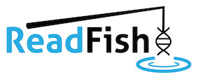
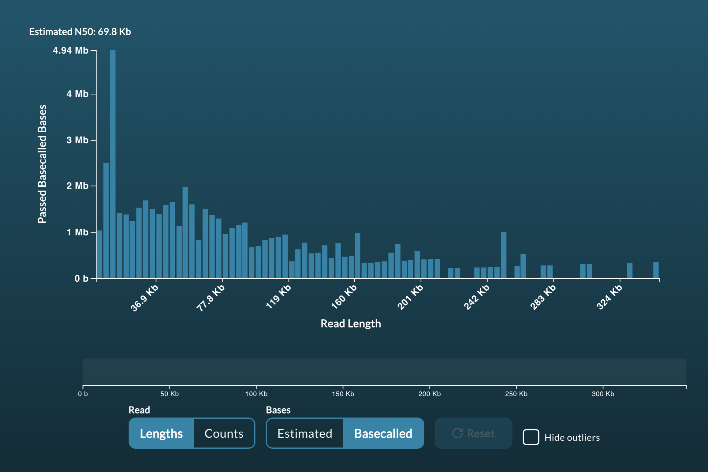
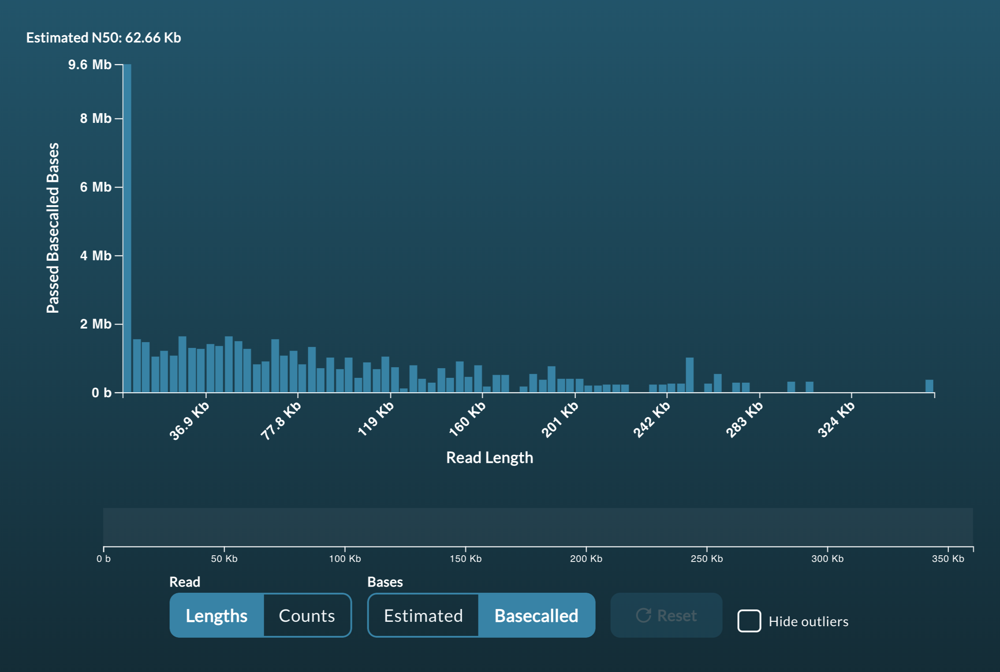
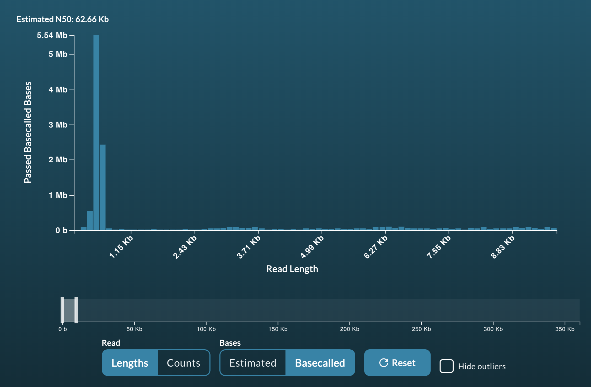
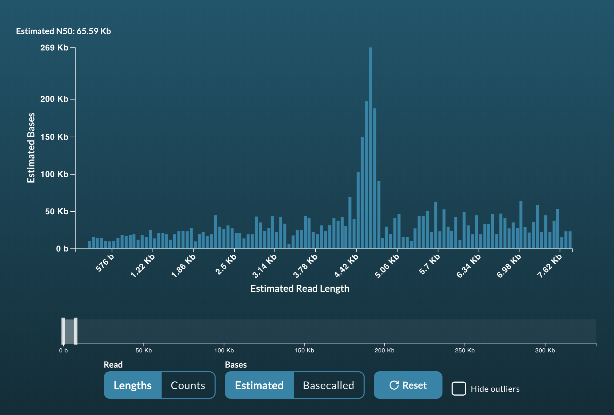
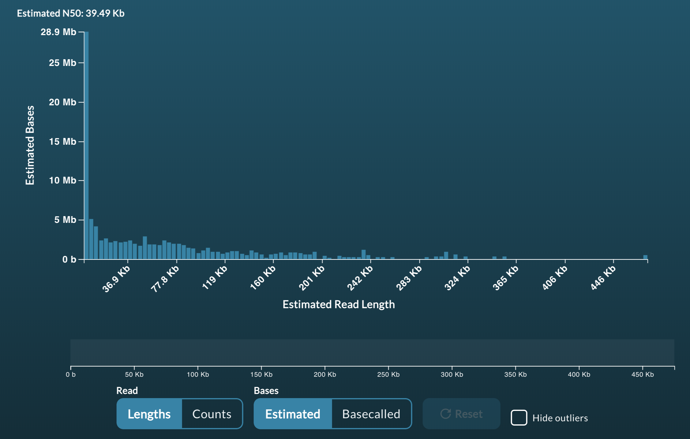
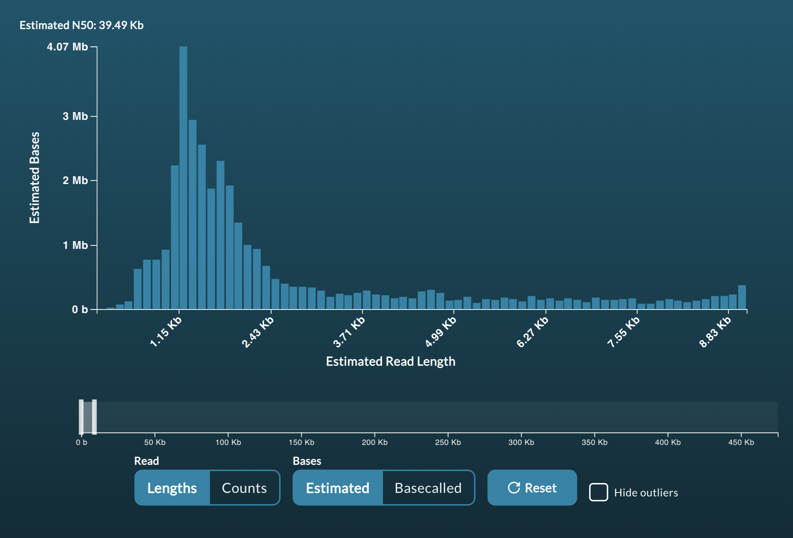

# 

If you are anything like us, reading a README is the last thing you do when running code. 
PLEASE DON'T DO THAT FOR READFISH. This will effect changes to your sequencing and - 
if you use it incorrectly - cost you money. We have added a [list of GOTCHAs](#common-gotchas) 
at the end of this README. We have almost certainly missed some... so - if something goes 
wrong, let us know so we can add you to the GOTCHA hall of fame!

This is a Python3 package that integrates with the 
[Read Until API](https://github.com/nanoporetech/read_until_api). 

The Read Until API provides a mechanism for an application to connect to a
MinKNOW server to obtain read data in real-time. The data can be analysed in the
way most fit for purpose, and a return call can be made to the server to unblock
the read in progress and so direct sequencing capacity towards reads of interest.


**This implementation of ReadFish requires Guppy version >= 4.0.11 and MinKNOW version core >= 4.0.4 . It will not work on earlier versions.** 


**Currently we only recommend LINUX for running ReadFish. We have not had 
effective performance on other platforms to date.**

The code here has been tested with Guppy in GPU mode using GridION Mk1 and 
NVIDIA RTX2080 on live sequencing runs and an NIVIDA GTX1080 using playback 
on a simulated run (see below for how to test this).  
This code is run at your own risk as it DOES affect sequencing output. You 
are **strongly** advised to test your setup prior to running (see below for 
example tests).

Citation
--------
If you use this software please cite: [10.1101/2020.02.03.926956](https://dx.doi.org/10.1101/2020.02.03.926956)

> Nanopore adaptive sequencing for mixed samples, whole exome capture and targeted panels  
> Alexander Payne, Nadine Holmes, Thomas Clarke, Rory Munro, Bisrat Debebe, Matthew Loose  
> bioRxiv 2020.02.03.926956; doi: https://doi.org/10.1101/2020.02.03.926956

Installation development version
------------
```bash
# Make a virtual environment
python3 -m venv readfish
. ./readfish/bin/activate
pip install --upgrade pip

# Install our ReadFish Software
pip install git+https://github.com/nanoporetech/read_until_api@v3.0.0
pip install git+https://github.com/LooseLab/readfish@dev

# Install ont_pyguppy_client_lib that matches your guppy server version. E.G.
pip install ont_pyguppy_client_lib==4.0.11
```

Usage
-----
```bash
# check install
$ readfish
usage: readfish [-h] [--version]
                {targets,align,centrifuge,unblock-all,validate,summary} ...

positional arguments:
  {targets,align,centrifuge,unblock-all,validate,summary}
                        Sub-commands
    targets             Run targeted sequencing
    align               ReadFish and Run Until, using minimap2
    centrifuge          ReadFish and Run Until, using centrifuge
    unblock-all         Unblock all reads
    validate            ReadFish TOML Validator
    summary             Summary stats from FASTQ files

optional arguments:
  -h, --help            show this help message and exit
  --version             show program's version number and exit

See '<command> --help' to read about a specific sub-command.

# example run command - change arguments as necessary:
$ readfish targets --experiment-name "Test run" --device MN17073 --toml example.toml --log-file RU_log.log
```

TOML File
---------
For information on the TOML files see [TOML.md](TOML.md).

Testing
-------
To test readfish on your configuration we recommend first running a playback 
experiment to test unblock speed and then selection.

#### Configuring bulk FAST5 file Playback
1. Download an open access bulk FAST5 file from 
[here](http://s3.amazonaws.com/nanopore-human-wgs/bulkfile/PLSP57501_20170308_FNFAF14035_MN16458_sequencing_run_NOTT_Hum_wh1rs2_60428.fast5). 
This file is 21Gb so make sure you have plenty of space.
1. To configure a run for playback, you need to find and edit a sequencing TOML 
file. These are typically located in `/opt/ont/minknow/conf/package/sequencing`. 
Edit a file such as sequencing_MIN106_DNA.toml and under the entry `[custom_settings]` 
add a field: 
    ```text
    simulation = "/full/path/to/your_bulk.FAST5"
    ```
1. If running GUPPY in GPU mode, set the parameter `break_reads_after_seconds = 1.0` 
to `break_reads_after_seconds = 0.4`.
1. If using MinKNOW 4.0 or later, you need to reload scripts. 
To do so, click on "start" to setup a new run. 
Then choose "start sequencing". 
In the next window you will see three dots arranged one above the other in an icon in the top right hand corner. 
Click these and choose `Reload Scripts`. 
Your version of MinKNOW will now playback the bulkfile rather than live sequencing.
1. Insert a configuration test flowcell into the sequencing device.
1. Start a sequencing run as you would normally, selecting the corresponding flow 
cell type to the edited script (here FLO-MIN106) as the flowcell type.
1. The run should start and immediately begin a mux scan. Let it run for around 
fifteen minutes after which your read length histogram should look as below:
    
1. Now stop the run.

#### Testing unblock response
Now we shall test unblocking by running `readfish unblock-all` which will simply eject 
every single read on the flow cell.
1. Start a new sequencing run as above.
1. Now start a `readfish unblock-all` run. To do this run:
    ```bash
    readfish unblock-all --device <YOUR_DEVICE_ID> --experiment-name "Testing ReadFish Unblock All"
    ```   
1. Leave the run for around 15 minutes and observe the read length histogram. 
If unblocks are happening correctly you will see something like the below:
    
A closeup of the unblock peak shows reads being unblocked quickly:
    
This compares with the control run:    
    

If you are happy with the unblock response, move onto testing basecalling.

If you are not happy with the unblock response you can try adjusting the throttle. 
This throttle limits the rate at which messages are sent to MinKNOW to perform unblocks.
By default we have set this to 0.4 seconds. 
In our experience setting the throttle to be same same size as the break_reads_after_seconds parameter can be helpful. 

To change this run:
```bash
readfish unblock-all --device <YOUR_DEVICE_ID> --experiment-name "Testing ReadFish Unblock All" --throttle <YOUR_VALUE_HERE>
```  


#### Testing basecalling and mapping.
To test selective sequencing you must have access to a 
[guppy basecall server](https://community.nanoporetech.com/downloads/guppy/release_notes) (>=4.0.4) 
and configure a [TOML](TOML.md) file. Here we provide an [example TOML file](examples/human_chr_selection.toml).
1. First make a local copy of the example TOML file:
    ```bash
    curl -O https://github.com/LooseLab/readfish/blob/master/examples/human_chr_selection.toml
    ```
1. Modify the `reference` field in the file to be the full path to a [minimap2](https://github.com/lh3/minimap2) index of the human genome.
1. Modify the `targets` fields for each condition to reflect the naming convention used in your index. This is the sequence name only, up to but not including any whitespace.
e.g. `>chr1 human chromosome 1` would become `chr1`. If these names do not match, then target matching will fail.
1. We provide a [JSON schema](readfish/static/readfish_toml.schema.json) and a script for validating 
configuration files which will let you check if the toml will drive an experiment as you expect:
    
    ```bash
    readfish validate human_chr_selection.toml
    ```

    Errors with the configuration will be written to the terminal along with a text description of the conditions for the experiment as below.
    
    ```text
    readfish validate examples/human_chr_selection.toml
    😻 Looking good!
    Generating experiment description - please be patient!
    This experiment has 1 region on the flowcell

    Using reference: /path/to/reference.mmi

    Region 'select_chr_21_22' (control=False) has 2 targets of which 2 are
    in the reference. Reads will be unblocked when classed as single_off
    or multi_off; sequenced when classed as single_on or multi_on; and
    polled for more data when classed as no_map or no_seq.
    ```         
1. If your toml file validates then run the following command:
    ```bash
    readfish targets --device <YOUR_DEVICE_ID> \
                  --experiment-name "RU Test basecall and map" \
                  --toml <PATH_TO_TOML> \
                  --log-file ru_test.log
    ```
1. In the terminal window you should see messages reporting the speed of mapping of the form:
    ```text
    2020-02-24 16:45:35,677 ru.ru_gen 7R/0.03526s
    2020-02-24 16:45:35,865 ru.ru_gen 3R/0.02302s
    2020-02-24 16:45:35,965 ru.ru_gen 4R/0.02249s
    ```
   **Note: if these times are longer than 0.4 seconds (or your `break_reads_after_seconds` value) you may have performance issues.**

1. In the MinKNOW messages interface you should see the experiment description as generated by the readfish validate command above.   
         

 #### Testing expected results from a selection experiment.
 
 The only way to test readfish on a playback run is to look at changes in read length for rejected vs accepted reads. To do this:
 
 1. Start a fresh simulation run using the bulkfile provided above.
 2. Restart the readfish command (as above):
    ```bash
    readfish targets --device <YOUR_DEVICE_ID> \
                  --experiment-name "RU Test basecall and map" \
                  --toml <PATH_TO_TOML> \
                  --log-file ru_test.log
    ```
 3. Allow the run to proceed for at least 30 minutes (making sure you are writing out read data!).
 4. After 30 minutes it should look something like this:
        
Zoomed in on the unblocks: 
        
 4. Run `readfish summary` to check if your run has performed as expected. This file requires the path to your toml file followed by the path to your fastq reads. Typical results are provided below and show longer mean read lengths for the two selected chromosomes (here chr21 and chr22). Note the mean read lengths observed will be dependent on system performance. Optimal guppy configuration for your system is left to the user.
     ```text
    contig  number      sum   min     max    std   mean  median    N50
       chr1    2045  8031506   220  318254  15566   3927    1476  26513
      chr10    1109  4723969   263  261207  14559   4260    1592  27313
      chr11    1232  4754809   213  304465  16228   3859    1314  38943
      chr12    1050  4526674   261  166256  12536   4311    1508  23582
      chr13     684  3126069   184  299397  18358   4570    1573  35034
      chr14     796  4263462   242  249680  18806   5356    1502  37446
      chr15     994  5240288   245  187955  17111   5272    1489  48036
      chr16     429  2702573   233  180260  16343   6300    1841  33347
      chr17     574  3453521   271  388105  23709   6017    1482  69464
      chr18     538  3873005   349  274407  24659   7199    1424  70263
      chr19     483  2625211   248  163416  16557   5435    1564  43457
       chr2    1402  8174215   220  303798  19553   5830    1526  42543
      chr20     342  2214472   225  209686  20661   6475    1456  55394
      chr21      57  1758058   347  254718  46708  30843    9409  83729
      chr22      69   851125   447   77401  15509  12335    5952  25811
       chr3    2119  7585521   197  325017  14512   3580    1412  25708
       chr4    1367  8772764   211  307864  23260   6418    1605  64709
       chr5    1527  6629025   221  223762  15298   4341    1385  40421
       chr6    1450  6101223   236  260918  15773   4208    1514  28634
       chr7    1291  5812463   155  350180  16907   4502    1540  34863
       chr8    1001  4849272   214  317181  19480   4844    1420  50186
       chr9    1113  5505104   219  485498  21692   4946    1504  40112
       chrM      84   298104   276   16409   4132   3549    1694   9137
       chrX     941  5713488   213  320496  22251   6072    1409  65532
       chrY       5   138365  2043   87799  35701  27673   14315  87799
    ```
 **After completing your tests you should remove the simulation line from the sequencing_MIN106_DNA.toml file. You MUST then reload the scripts. If using Guppy GPU basecalling leave the break_reads_after_seconds parameter as 0.4.**
 
 Observant users may note that the median read lengths shown here are longer than we have previously described.
 These effects are all down to basecalling speed. We note that changes made to ONT basecalling configurations have changed speed performance. Users are advised to look at our basecalling page on the wiki.
 
    
 
 Common Gotcha's
 ----
 These may or may not (!) be mistakes we have made already...
 1. If the previous run has not fully completed - i.e is still basecalling or processing raw data,you may connect to the wrong instance and see nothing happening. Always check the previous run has finished completely.
 2. If you have forgotten to remove your simultation line from your sequencing toml you will forever be trapped in an inception like resequencing of old data... Don't do this!
 3. If basecalling doesn't seem to be working check:
    - Check your basecalling server is running.
    - Check the ip of your server is correct.
    - Check the port of your server is correct.
 4. If you are expecting reads to unblock but they do not - check that you have set `control=false` in your readfish toml file.  `control=true` will prevent any unblocks but does otherwise run the full analysis pipeline.
 5. Oh no - every single read is being unblocked - I have nothing on target! 
    - Double check your reference file is in the correct location.
    - Double check your targets exist in that reference file.
    - Double check your targets are correctly formatted with contig name matching the record names in your reference (Exclude description - i.e the contig name up to the first whitespace). 
 6. **Where has my reference gone?** If you are using a _live TOML file - e.g running iter_align or iter_cent, the previous reference MMI file is deleted when a new one is added. This obviosuly saves on disk space use(!) but can lead to unfortunate side effects - i.e you delete yoru MMI file. These can of course be recreated but user **beware**.
 
 Happy ReadFishing!

  Acknowledgements
 ----

We're really grateful to lots of people for help and support. Here's a few of them...

From the lab:
Teri Evans, Sam Holt, Lewis Gallagher, Chris Alder, Thomas Clarke

From ONT:
Stu Reid, Chris Wright, Rosemary Dokos, Chris Seymour, Clive Brown, George Pimm, Jon Pugh

From the Nanopore World:
Nick Loman, Josh Quick, John Tyson, Jared Simpson, Ewan Birney, Alexander Senf, Nick Goldman, Miten Jain

And for our Awesome Logo please checkout out [@tim_bassford](https://twitter.com/tim_bassford) from [@TurbineCreative](https://twitter.com/TurbineCreative)!
  
